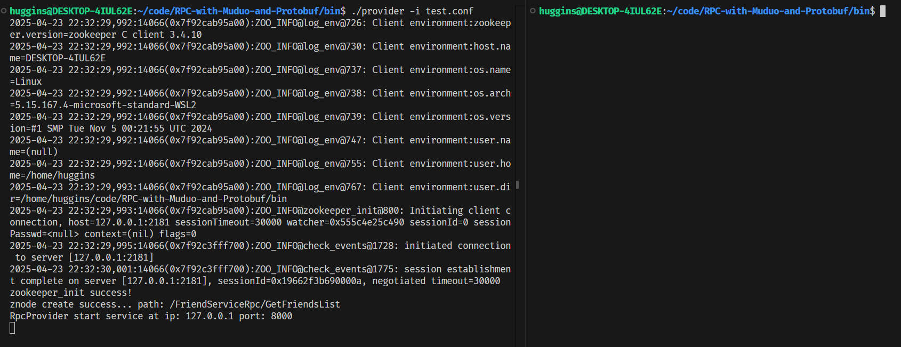
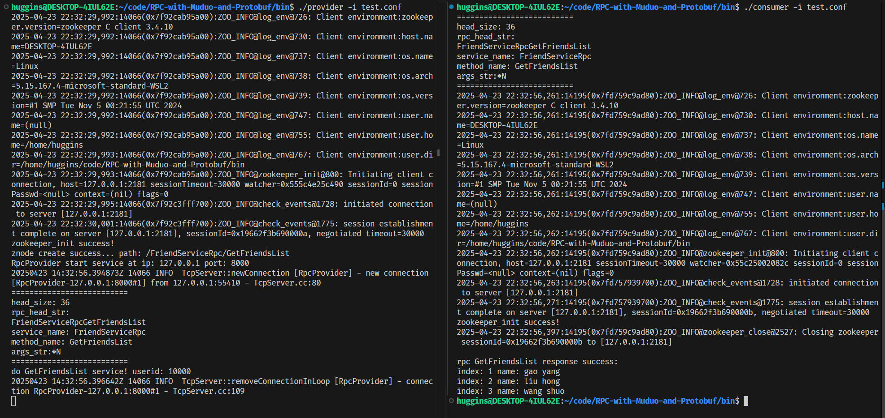

# PRC with Protobuf and Muduo

## 项目介绍
本项目设计并实现了一种分布式RPC框架，该框架使用`protobuf`作为数据的序列化/反序列化工具、`zookeeper`作为服务的配置中心以及[`Muduo`](https://github.com/chenshuo/muduo)网络库作为网络通信模块。该框架支持分布式环境下本地服务的注册、发布于远程调用，其核心目标是作为个人学习理解RPC原理，实现高并发网络编程于分布是协调技术。

## 项目编译

下载项目
```shell
git clone https://github.com/hugginse/RPC-with-Muduo-and-Protobuf
```

进入RPC-with-Muduo-and-Protubuf文件夹
```bash
cd RPC-with-Muduo-and-Protubuf/
```

一键编译安装
```bash
sudo ./autobuild.sh
```

## 案例运行

### 开启zookeeper服务

1. 设置`zookeeper配置文件`，当前路径处于zookeeper文件夹下，进入`conf`文件夹建立`zoo.cfg`配置文件
```bash
cd conf/
cp zoo_sample.cfg zoo.cfg
```

2. 修改`zoo.cfg`文件的`dataDir`（根据自己需求修改，默认的`/tmp/zookeeper`在每次关闭之后不保留节点信息）
```bash
vi zoo.cfg
#dataDir=/tmp/zookeeper
dataDir=/home/*userName/zookeeper/data
```

3. 进入`/bin`文件夹开启zookeeper服务
```bash
cd /bin
./zkServer.sh start
```

出现如下提示，表示zookeeper服务开启成功
```bash
Zookeeper JMX enabled by default
Using config:/home/xxx/xxx/zookeeper/bin/.../conf/zoo.cfg
Starting zookeeper ... already running as process xxx.
```
或者通过`sudo netstat -tanp`命令查看`2181`端口是否正常工作

### 运行example

1. 进入`RPC-with_Muduo-and-Protobuf/bin`文件夹，开启`provider`RPC服务
```bash
cd bin/
./provider -i test.conf
```
运行示例


2. 使用`consumer`RPC服务
```bash
./consumer -i test.conf
```
运行示例


进入RPC-with-Muduo-and-Protobuf文件夹


## RPC框架设计

### 概念

1. RPC(Remote Procedure Call Ptotocol)远程过程调用协议

2. RPC是一种通过网络(RPC框架解耦了网络代码和业务代码)从远程主机的程序上请求服务

3. RPC主要作用就是同的服务方法调用就像本地方法调用一样便捷

### RPC通信原理


* 黄色部分：设计RPC方法参数的打包和解析，即数据的序列化和反序列化

* 绿色部分：网络部分，包括寻找RPC服务主机，发起RPC调用请求和响应RPC调用结果。

### RPC优势

1. 简化分布式通信：RPC框架封装了底层的网络通信细节，简化了分布式通信的复杂性，给开发人员提供简便的调用远程服务（可以像调用本地方法一样）

2. 跨语言支持：RPC框架提供了跨语言的能力，使基于不同语言架构下的应用程序可以进行交互。

3. 性能：RPC使用更加高效的传输协议和序列化方法，减少了通信的开销

### RPC使用场景

1. 大型网站：内部涉及多个子系统，如：（订单系统、支付系统、商品系统、用户系统...等组成的系统），每个子系统可单独部署

2. 接口访问量大：RPC基于长连接，要求满足支持”负载均衡”，“熔断降级”一类面向服务的高级特性

3. 微服务化治理：微服务架构、分布式架构
